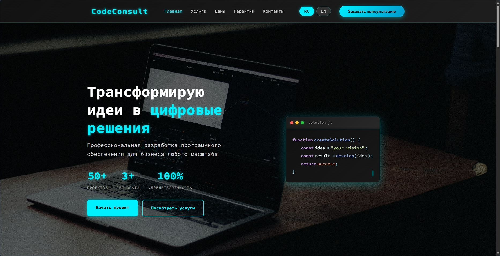
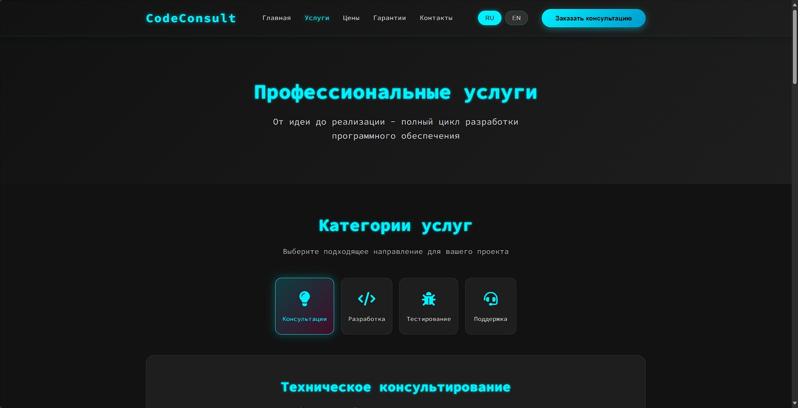
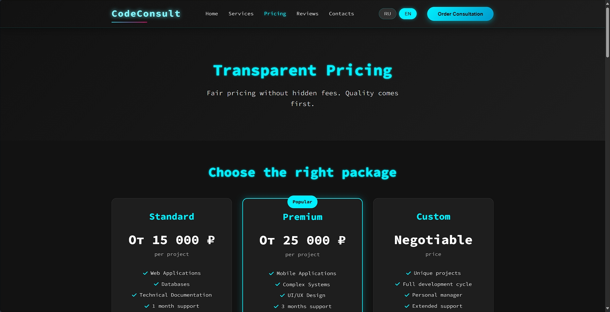
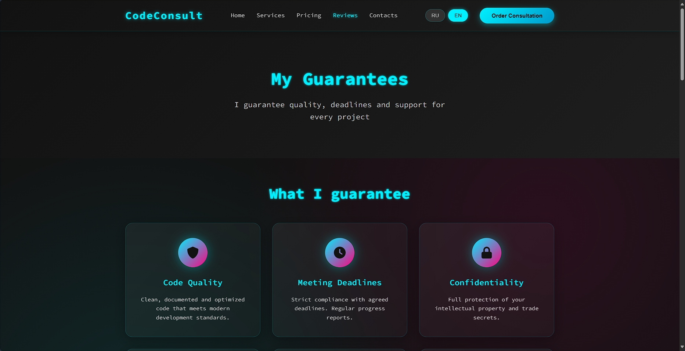
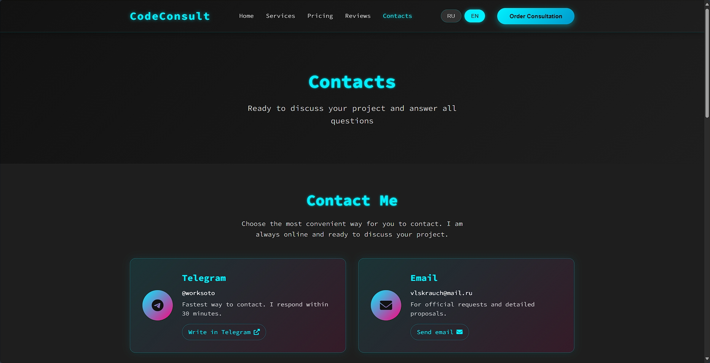

# CodeConsult - Professional IT Solutions

Modern web platform for programming services and software development. Showcases expertise in creating comprehensive digital solutions for business.

## 📋 About the Project

**CodeConsult** is a modern web platform showcasing expertise in software development. The project is designed for professional presentation of programming services and includes a fully functional website with modern design and interactive elements.

## 🎯 Key Features

- **Responsive Design** - Correct display on all devices
- **Modern Architecture** - Clean code, optimized performance
- **Multi-page Structure** - Complete information about services and projects
- **Interactive Components** - Animations, particle effects, dynamic content
- **SEO Optimization** - Prepared for search engines
- **Professional Design** - Dark theme, strict business style

## 📸 Project Screenshots

### Home Page

*Home page with animated code window and statistics*

### Services Page

*Detailed description of technical capabilities and services*

### Pricing Page

*Transparent pricing system with service packages*

### Reviews Page

*Real client testimonials and project case studies*

### Contacts Page

*Contact form and information*

## 📹 Video Preview

You can watch the project demo video at: `preview/2025-09-23 14-24-26.mp4`

## 🚀 Technologies

### Frontend
- **HTML5** - Semantic markup for page structure
- **CSS3** - Responsive layout with Grid, Flexbox, animations
- **JavaScript** - Interactivity with ES6+, modules, async/await
- **Canvas API** - Graphics effects for particle animations

### Backend & Tools
- **Node.js** - Runtime environment (available)
- **Python** - Automation and scripting
- **PostgreSQL** - Main database (ready for integration)
- **Git** - Version control (actively used)

## 📁 Project Structure

```
CodeConsult/
├── index.html              # Home page
├── services.html           # Services
├── pricing.html            # Pricing
├── reviews.html            # Reviews
├── contacts.html           # Contacts
├── header.html             # Site header
├── footer.html             # Site footer
├── LICENSE                 # License
├── README.md               # Documentation
├── css/
│   ├── styles.css          # Main styles
│   └── pages/              # Page styles
├── js/
│   ├── script.js           # Main script
│   └── pages/              # Page scripts
├── images/                 # Graphic resources
└── preview/                # Screenshots
```

## ⚡ Quick Start

### Requirements
- Web browser with HTML5 support
- Local web server (optional)

### Installation

1. **Clone the repository:**
   ```bash
   git clone https://github.com/unSoto/CodeConsult.git
   cd CodeConsult
   ```

2. **Start the server:**
   ```bash
   # Option 1: Python 3
   python -m http.server 8000

   # Option 2: Node.js
   npx http-server -p 8000

   # Option 3: PHP
   php -S localhost:8000
   ```

3. **Open in browser:**
   ```
   http://localhost:8000
   ```

## 📱 Responsiveness

| Device | Resolution | Support |
|--------|------------|---------|
| Mobile | 320px+ | Full |
| Tablets | 768px+ | Full |
| Laptops | 1024px+ | Full |
| Desktops | 1200px+ | Full |

## 🎨 Design and UX

### Visual Features
- Dark color scheme for professional appearance
- Readable typography with clear hierarchy
- Smooth animations for interactive elements
- Intuitive navigation with logical structure

### Technical Specifications
- Optimized performance
- Semantic markup
- Valid HTML/CSS
- Scalable architecture

## 🤝 Contacts

**VLADISLAV** - Full-Stack Developer

- **Email:** [vlskrauch@mail.ru](mailto:vlskrauch@mail.ru)
- **Telegram:** [@worksoto](https://t.me/worksoto)

## 📜 License

**⚠️ WARNING:** This project is protected by a **proprietary license**.

**Prohibited:**
- Commercial use without permission
- Copying code for profit
- Creating derivative products for sale

**Allowed:**
- Studying code for educational purposes
- Personal non-commercial use
- Portfolio demonstration

[📄 Detailed Terms](LICENSE)

---

**© 2025 CodeConsult. All rights reserved.**
